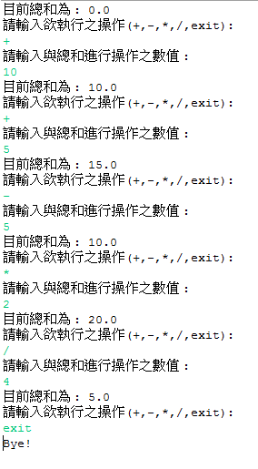

**程式題目：循環計算器**

1.  **程式介紹**

    1.  請寫出一個可以對數字做出簡單運算(+,-,\*,/)的程式

2.  **程式流程**

    1.  第一行請顯示目前數值的總和，初始為0。

    2.  第二行請輸入想要進行的操作(+,-,\*,/,exit)。

    3.  第三行請輸入欲進行操作的數值。

    4.  除數不可為0，請進行除錯判斷(回到重新操作)。

    5.  會有小數，宣告請使用double型態。

    6.  字串的比對請使用equal函式(ex. B.equals("+")
        代表若是B字串和加號相同，則會回傳true。

    7.  在第二行(執行操作那行)輸入 exit 則結束程式。

**提示字元如下圖範例**

